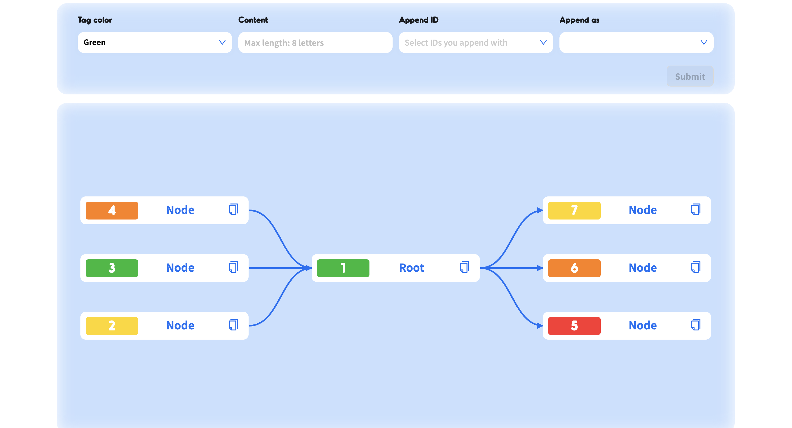

  

# D3-DAG

## Create a node relationship graph using Directed Acyclic Graph (DAG), with the ability to add nodes at any position and regenerate the graph.

A side project for visualizing tracking data from my previous project, allowing adding custom nodes to generate a relationship chart

- Using D3.js to create the graph.
- Drawing node styles using SVG.
